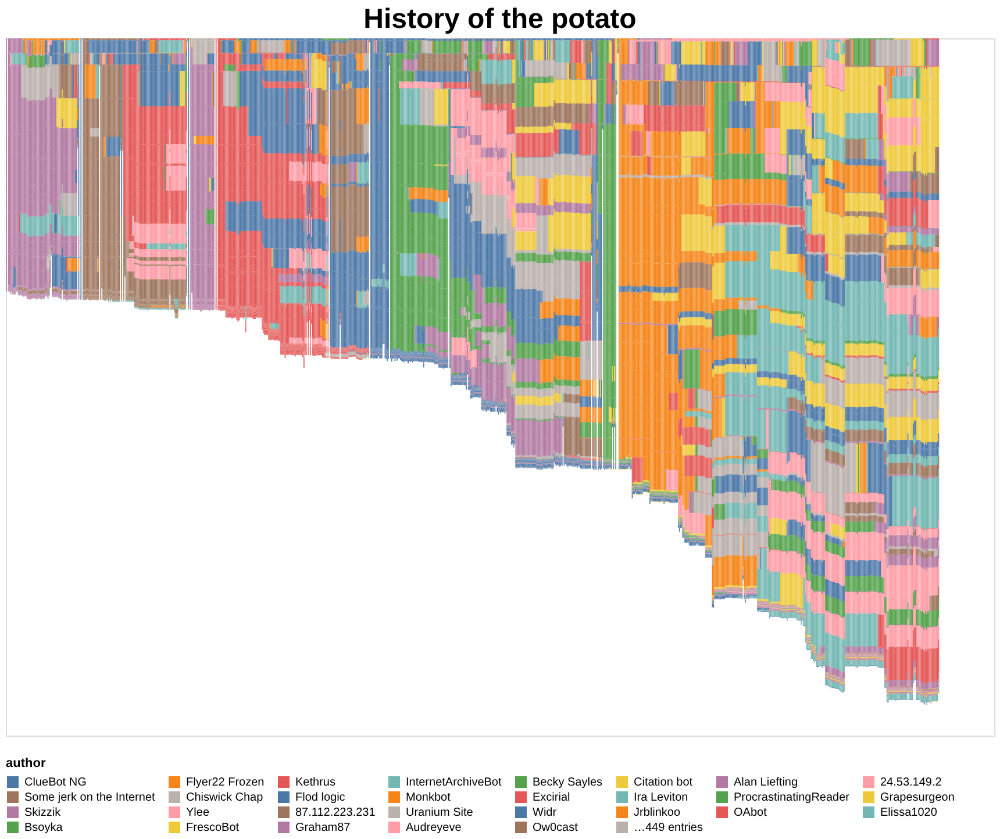

# History Flow

A from-scratch, opinionated Rust re-implementation of IBM's _History Flow_: a
visualization of how a document evolved across revisions — a Wikipedia page or a
single Git-tracked file — drawn as an author-colored stacked-bar chart.

Each column is one revision; column height is proportional to content size;
color is the contributing author. Attribution uses a **provenance graph**, so
deleted-then-restored (reverted) text re-links to its **original author** — the
piece `git blame` cannot do.

## Screenshots



## Delivery forms

- **Library** — the pipeline stages (`import` → `attribution` → `visualize`) are
  public functions in the `history_flow` crate, usable from the CLI, a web
  server, or your own code.
- **CLI** — subcommands: `probe`, `json`, `render`, `serve`.
- **Web** — `serve` starts an interactive single-page app: paste a Wikipedia
  title/URL or GitHub `blob/<rev>/<path>` URL, configure advanced options in a
  collapsible panel, and the chart renders client-side with a color legend and
  wheel-zoom/pan. Results appear in **Interactive** and **SVG** tabs, with
  **Download JSON** / **Download PNG** (PNG is always the full, un-zoomed chart).
  The web server is remote-only — it will not open a local git repository.

## Quick start

```
cargo install --path .

# Size up a source first (see below) — then render it.
history-flow render "Evolution"                        # Wikipedia title
history-flow render https://en.wikipedia.org/wiki/Evolution
history-flow render --source git --repo /path/to/repo --page notes.txt
history-flow render --source git --repo owner/repo --page README.md --mode last --last 50
history-flow serve                   # open http://127.0.0.1:8080 and enter a target
history-flow serve 0.0.0.0:8080       # custom bind address (positional HOST:PORT)
```

`render` emits a self-contained HTML page (Vega-Lite spec + bundled JS inlined,
no CDN) on stdout, or use `--format json` for the raw spec / `-o file` to write
it to disk.

## Size up a source first

`probe` reports the revision count and time range _without_ downloading full
content — use it to decide `--mode all` vs `last=N` / `nth=N` before a heavy
render:

```
history-flow probe "Evolution"
history-flow probe --source git --repo /path/to/repo --page notes.txt
history-flow probe --json https://github.com/owner/repo/blob/main/README.md
```

`--mode all` renders every revision (`last=200` / `nth=5` defaults bound the
cost). Large or long-lived sources benefit from `--mode last --last 100`.

## Web interface

```
history-flow serve [HOST:PORT] [<url-or-title>]
```

Starts the interactive web app (default `127.0.0.1:8080`). The bind address is a
positional `HOST:PORT` (optional). A positional target or `--url`/`--page` may be
given to pre-fill the input, but you can also just open the page and type a
target. Features:

- **Single input**: a Wikipedia title/URL or GitHub `blob/<rev>/<path>` URL.
- **Advanced options**: collapsible panel for attribution/import/matching.
- **Chart**: author-colored stacked bars; one column per revision, height by
  content size; color legend; title labels the topic/file (derived from the
  Wikipedia page title, GitHub file name, or git path). Wheel-zoom and
  drag-pan in the Interactive tab.
- **Tabs**: switch between the interactive view and a static **SVG** snapshot.
- **Downloads**: **Download JSON** (the Vega-Lite spec) and **Download PNG** (a
  2× export of the full chart, always un-zoomed).
- Progress indicator (spinner) is shown while the spec is generated and drawn.
- **Probe endpoint**: `GET /probe?target=...` returns `{revisions, first, last}`
  without downloading full content — used by the "Size up" button.

> **Remote-only.** The web server runs on the user's machine but refuses to
> process a _local_ git repository over HTTP (it only handles Wikipedia and
> GitHub blob URLs). Use the CLI `render`/`json` for local-repo analysis.

## CLI reference

```
history-flow <probe|json|render|serve> [flags] [<url-or-title>]
```

Global source flags (shared by all pipeline subcommands):

| flag                                  | meaning                                     |
| ------------------------------------- | ------------------------------------------- |
| `--url <URL>`                         | Wikipedia or GitHub URL                     |
| `--source wikipedia\|git`             | source backend                              |
| `--page <STRING>`                     | Wikipedia title, or one tracked git file    |
| `--repo <REPO>`                       | git: local path or owner/repo               |
| `--mode all\|last\|nth`               | revision selection                          |
| `--last <N>`                          | N when `--mode last` (default 200)          |
| `--nth <N>`                           | N when `--mode nth` (default 5)             |
| `--attr-mode provenance\|last_editor` | attribution mode                            |
| `--match-mode exact\|fuzzy`           | text re-link matching                       |
| `--fuzzy-thresh <FLOAT>`              | similarity for fuzzy re-link (default 0.95) |

Subcommand-specific flags:

| subcommand | flag                  | meaning                                  |
| ---------- | --------------------- | ---------------------------------------- |
| `probe`    | `--json`              | output probe result as JSON              |
| `json`     | `-o, --output <FILE>` | write JSON grid to file (default stdout) |
| `render`   | `--format json\|html` | output format (default `html`)           |
| `render`   | `-o, --output <FILE>` | write output to file (default stdout)    |

> **Note:** A `--config <PATH>` flag exists on all subcommands but is not yet
> implemented; a config file loader (discovering `./config.toml`,
> `~/.config/history-flow/config.toml`) is planned.

If no flag names a source, the positional argument is used: a GitHub
`blob/<rev>/<path>` URL → git; a Wikipedia URL or anything else → Wikipedia.
Both `--url` and `--source`/`--page` together is an error.

`json` prints the per-revision author grid (revision × line → `{author, size}`)
as JSON. `render` renders that grid as the chart; `serve` does the same over
HTTP. Structured output goes to stdout; progress and timings go to stderr.

## Defaults

| setting           | default      |
| ----------------- | ------------ |
| `source` / `page` | unset        |
| `mode`            | `all`        |
| `last`            | 200          |
| `nth`             | 5            |
| `attr-mode`       | `provenance` |
| `match-mode`      | `exact`      |
| `fuzzy-thresh`    | 0.95         |

A `config.toml` file-loader (discovery of `--config`, `./config.toml`,
`~/.config/history-flow/config.toml`) is planned; flags currently override these
built-in defaults.

## License

Copyright © 2026 André Santos

MIT — see [LICENSE](LICENSE) for details.

## Acknowledgements / Related work

- **IBM's History Flow** — the original visualization this project re-implements.
- The research paper: Fernanda B. Viégas & Martin Wattenberg, _History Flow:
  Results on the Analysis and Manipulation of Wiki Histories_, CHI 2004.
- https://www.moma.org/collection/works/110349 -- the original History Flow visualization is in the MoMA collection.
- http://hint.fm/projects/historyflow/ -- the original History Flow project page.
- https://github.com/rdmpage/wikihistoryflow — a related implementation.
- Jeff Atwood, _Mixing Oil and Water — Authorship in a Wiki World_,
  https://blog.codinghorror.com/mixing-oil-and-water-authorship-in-a-wiki-world/
